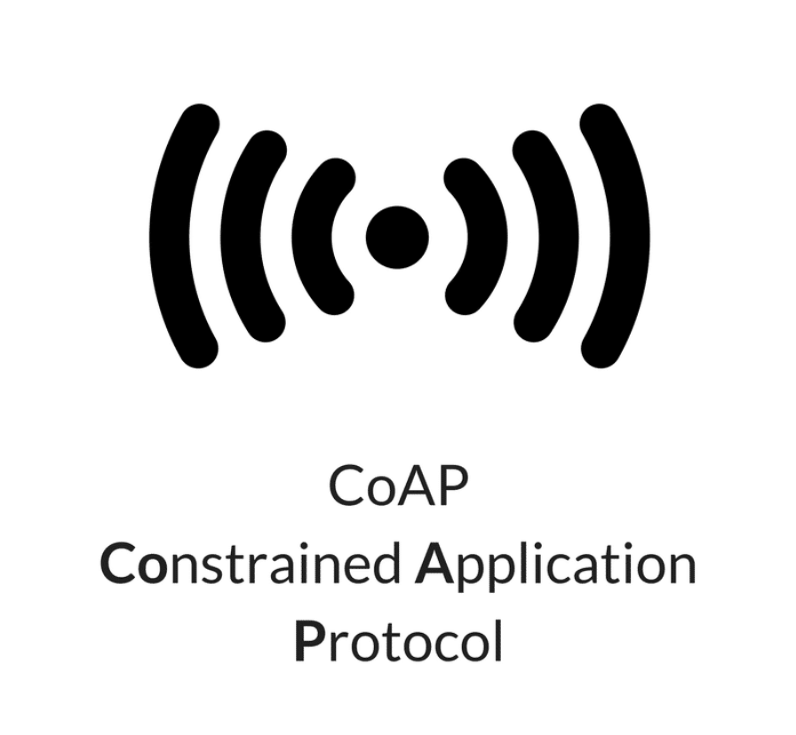

# Title: Constrained Application Protocol (CoAP)

The Constrained Application Protocol (CoAP) is a lightweight web transfer protocol designed for resource-constrained devices in IoT environments. It operates over UDP, offering efficient communication with low overhead. CoAP supports RESTful interactions similar to HTTP but optimized for constrained networks. Its compact design makes it ideal for applications requiring low power and minimal bandwidth.

### Presentation Link: [Link to video](https://youtu.be/69yygCWtsxo)
### Name: Keyhan Masoudi
