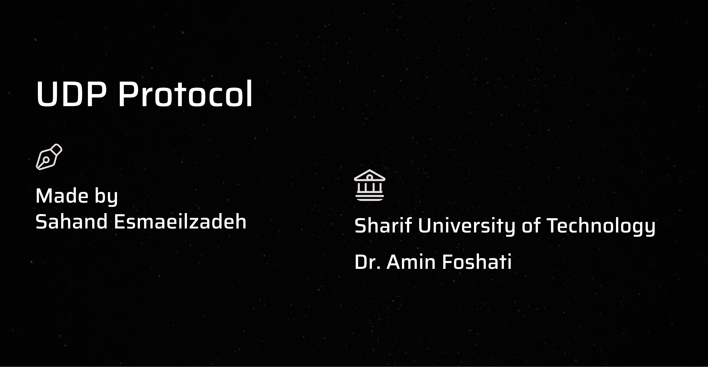

<!-- # UDP Protocol -->

This presentation begins with a brief introduction to the Transport Layer, highlighting its role in facilitating communication between devices on a network. It then shifts focus to the main subject, UDP (User Datagram Protocol), covering its basic principles. The presentation further explores the UDP header, detailing its structure, and concludes with an explanation of the UDP checksum. Finally, it examines some common usages of UDP in network communication.

### Presentation link: [Link to presentation](https://gamma.app/docs/UDP-Protocol-gi6s2kpzqqmtw05)

### Presentation Video Link: [Link to video](https://www.aparat.com/v/rtry615)
### Name: Sahand Esmaeilzadeh
